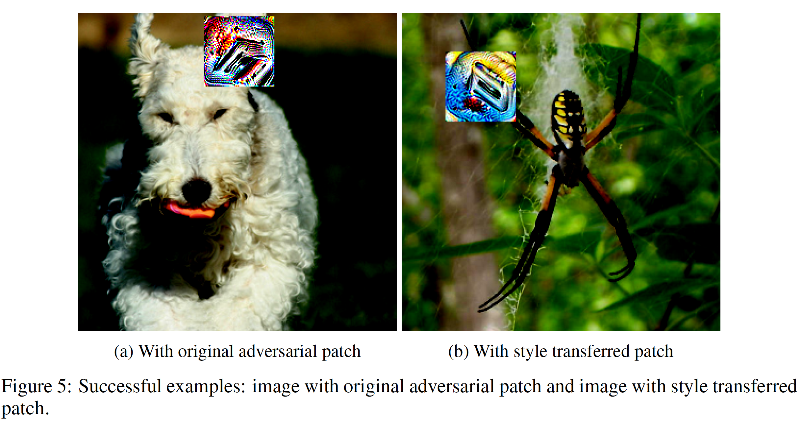
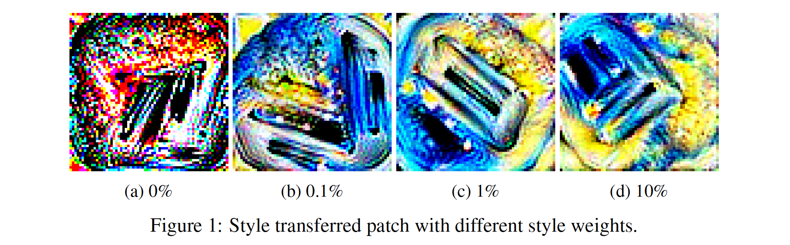

# Final-Project: Adverarial Patch
## Summary

Adversarial patch is type of attack that any image with adversarial patch will be recognized as target class. For example, no matter what image contains (apple, phone, human, etc.), when it adds an adversarial patch of class toaster, all of them will be classified as toaster, and this attack can even be used in physical world.

We are curious about generation of adversarial patch and its variation and application. In this project, we try to beautify and disguise adversarial patch using style transfer.

## Results

### Style transfered adversarial patch

### Different style weighted patch

For more details please refer to the report.

## Resources

- (patch)[jhayes14/adversarial-patch](https://github.com/jhayes14/adversarial-patch)
- (I2I translation)[mingyuliutw/UNIT](https://github.com/mingyuliutw/UNIT)
- (style transfer)[eriklindernoren/Fast-Neural-Style-Transfer](https://github.com/eriklindernoren/Fast-Neural-Style-Transfer)

## Contact

If you have any question, please feel free to contact me by sending email to [r08946014@ntu.edu.tw](mailto:r08946014@ntu.edu.tw)

