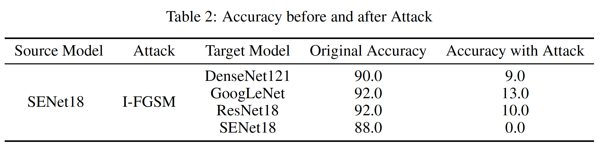
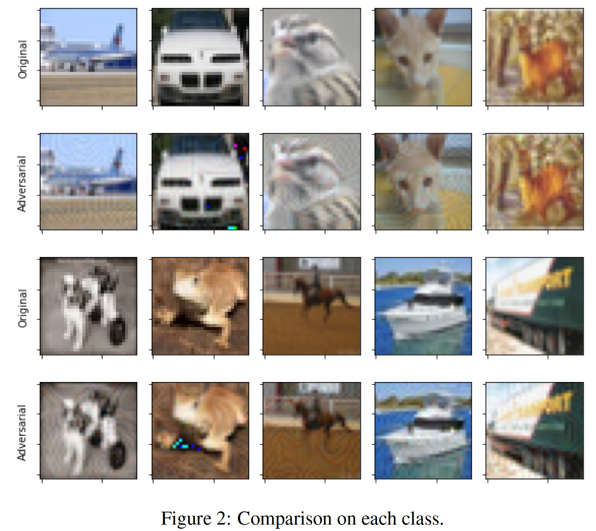

# Homework 1: Gray-Box Attack

## Goal

Create untargeted adversarial examples to attack models for the CIFAR-10 classification task. Try bring down the model accuracy as much as possible.

## Abstract 

In this homework, I use 4 models pretrained on CIFAR-10: ResNet18, DenseNet121, GoogLeNet and SENet18. Considering the transferability of adversarial attacks, I apply two variants of FGSM: I-FGSM and MI-FGSM. Moreover, to further enhance the transferability, I also use Intermediate Level Attack (ILA), which attempts to fine-tune an existing adversarial example by increasing its perturbation on a pre-specified layer of the source model. According to the experimental results, with the best combinations of the choices of methods mentioned above, the adversarial examples can achieve the mean accuracy of 3% on CIFAR-10 evaluation set. Additionally, I conduct quantitative analysis and case studies to demonstrate the effectiveness of applying ILA with specific model and attack.

## Results

### Model Performance



### Result Comparison



For more details please refer to the report.

## Steps

0. Go to directory `src/`

1. Advise prefix in `environment.yml `

2. Create Conda environment
```
conda env create -f src/environment.yml 
```

3. Activate the environment
```
conda activate SPML_HW1
```

4. Run the main program
```
time python all_in_one_cifar10.py --source_models SENet18  --transfer_models ResNet18 DenseNet121 GoogLeNet SENet18 --attacks ifgsm --num_batches=100 --batch_size=1
```

## Visualize
1. Output adversarial images
```
python output_adv_imgs.py
```

2. To see the tables and the figures used in PDF, run all cells in `visualize.ipynb`

## Contact

If you have any question, please feel free to contact me by sending email to [r08946014@ntu.edu.tw](mailto:r08946014@ntu.edu.tw)

