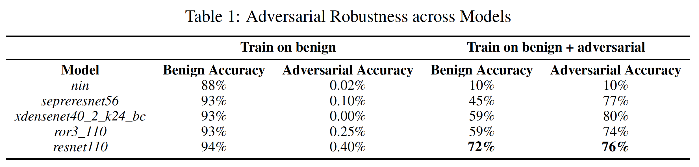

# SPML
Security and Privacy of Machine Learning (NTU Course 2020)

## Summary 

### Homework 1: Gray-Box Attack

Create untargeted adversarial examples to attack models for the CIFAR-10 classification task. Try bring down the model accuracy as much as possible.

### Homework 2: Black-Box Defense

Train a robust model for CIFAR-10 that can defend adversarial examples. 

### Final Project: Adversarial Patch

Adversarial patch is type of attack that any image with adversarial patch will be recognized as target class. For example, no matter what image contains (apple, phone, human, etc.), when it adds an adversarial patch of class toaster, all of them will be classified as toaster, and this attack can even be used in physical world.

## Contact

If you have any question, please feel free to contact me by sending email to [r08946014@ntu.edu.tw](mailto:r08946014@ntu.edu.tw)

